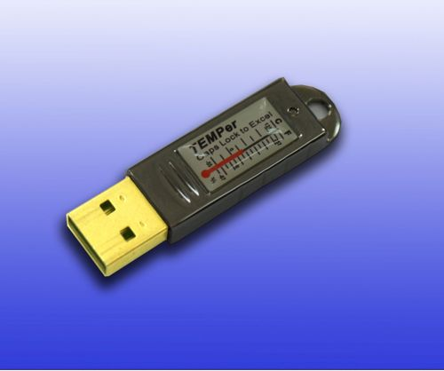

PCSensor / TEMPer2 driver for Linux/Solaris 
====



A CLI tool for PCsensor TEMPer USB thermometer. http://www.pcsensor.com/

This is based on PCSensor v. 1.0.1 by Juan Carlos Perez, introduced at https://relavak.wordpress.com/2009/10/17/temper-temperature-sensor-linux-driver/

Support device 0c45:7401 known as Gold TEMPer. (image above)

I have worked on, 
- Change libusb-0.1 -> libusb-1.0 (to be able to build on Solaris)
- Support multiple devices
- Add Munin plugin http://munin-monitoring.org/
- Some code cleanups, fix indents, typos, ...

# Build
## Solaris 11
```
# pkg install gcc libusb-1
$ make
...
# cp pcsensor /usr/local/bin/
```

## RHEL 6
```
# yum install gcc libusb1-devel
$ make
...
# cp pcsensor /usr/local/bin/
```

# Usage
```
$ sudo ./pcsensor
2017-08-31T19:00:35  0  internal  27.38
2017-08-31T19:00:35  0  external  101.45
2017-08-31T19:00:35  1  internal  27.31
2017-08-31T19:00:35  1  external  101.45
...
```

libusb_detach_kernel_driver does not seem to work on Solaris. Thus, it looks necessary to unload hid driver manually.
Are there any better solutions? (See pcsensor.sh)


Original document below
====
```
pcsensor
========

PCSensor / TEMPer2 driver for linux

This is based on PCSensor v. 1.0.1 by Juan Carlos Perez

All I've done is tweak the tool to output both the temperature from the internal
as well as the external sensor.

/*
 * pcsensor.c by Juan Carlos Perez (c) 2011 (cray@isp-sl.com)
 * based on Temper.c by Robert Kavaler (c) 2009 (relavak.com)
 * All rights reserved.
 *
 * 2011/08/30 Thanks to EdorFaus: bugfix to support negative temperatures
 *
 * Temper driver for linux. This program can be compiled either as a library
 * or as a standalone program (-DUNIT_TEST). The driver will work with some
 * TEMPer usb devices from RDing (www.PCsensor.com).
 *
 * Redistribution and use in source and binary forms, with or without
 * modification, are permitted provided that the following conditions are met:
 *     * Redistributions of source code must retain the above copyright
 *       notice, this list of conditions and the following disclaimer.
 *
 * THIS SOFTWARE IS PROVIDED BY Juan Carlos Perez ''AS IS'' AND ANY
 * EXPRESS OR IMPLIED WARRANTIES, INCLUDING, BUT NOT LIMITED TO, THE IMPLIED
 * WARRANTIES OF MERCHANTABILITY AND FITNESS FOR A PARTICULAR PURPOSE ARE
 * DISCLAIMED. IN NO EVENT SHALL Robert kavaler BE LIABLE FOR ANY
 * DIRECT, INDIRECT, INCIDENTAL, SPECIAL, EXEMPLARY, OR CONSEQUENTIAL DAMAGES
 * (INCLUDING, BUT NOT LIMITED TO, PROCUREMENT OF SUBSTITUTE GOODS OR SERVICES;
 * LOSS OF USE, DATA, OR PROFITS; OR BUSINESS INTERRUPTION) HOWEVER CAUSED AND
 * ON ANY THEORY OF LIABILITY, WHETHER IN CONTRACT, STRICT LIABILITY, OR TORT
 * (INCLUDING NEGLIGENCE OR OTHERWISE) ARISING IN ANY WAY OUT OF THE USE OF THIS
 * SOFTWARE, EVEN IF ADVISED OF THE POSSIBILITY OF SUCH DAMAGE.
 *
 */
```
